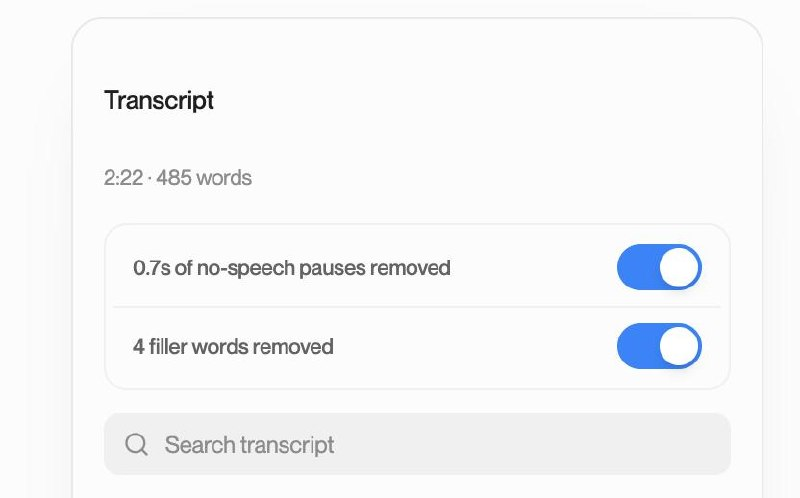
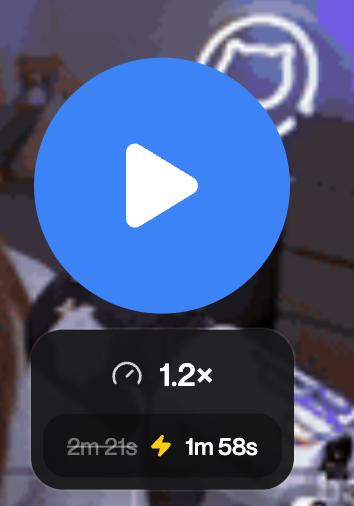
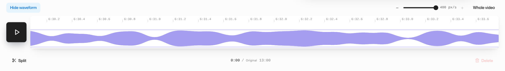

<p align="center">
	
</p>

<h1 align="center">Cap</h1>

<p align="center">
	Beautiful, shareable screen recordings. Open source, fast, and built for teams that want to own their data.
</p>

<p align="center">
	<a href="https://cap.so">Website</a>
	 |
	<a href="https://cap.so/download">Download</a>
	 |
	<a href="https://cap.so/docs">Docs</a>
	 |
	<a href="https://cap.so/pricing">Pricing</a>
	 |
	<a href="https://cap.link/discord">Discord</a>
</p>

<p align="center">
	<a href="https://console.algora.io/org/CapSoftware/bounties?status=open">
		
	</a>
</p>

> [!IMPORTANT]
> **About this fork:** This is AlphaComposite's maintained public fork of
> [Cap](https://github.com/CapSoftware/Cap), whose original authors and
> canonical repository remain at CapSoftware/Cap. The fork's `main` branch is
> kept as a clean upstream mirror, while `downstream/main` carries the
> additions described in [What this fork adds](#what-this-fork-adds). It is not an official CapSoftware distribution. See
> [DOWNSTREAM_MAINTENANCE.md](DOWNSTREAM_MAINTENANCE.md) for branch policy,
> upstream synchronization, verification, and contribution guidance.

## What this fork adds

This fork turns Cap's web app into a fast, Loom-style async video tool:
record in Chrome, get a playable link within seconds of Stop, clean the video
up from its transcript, and publish the edit instantly. Every edit is
non-destructive, so the original recording is always kept and any cut can be undone.

- [Near-instant processing](#near-instant-processing-h264-instead-of-webm)
- [Instant, non-destructive editing](#instant-non-destructive-editing)
- [Waveform timeline](#waveform-timeline)
- [Summaries](#summaries)
- [Chapters](#chapters)
- [AI titles and provider fallback](#ai-titles-and-provider-fallback)
- [Private, per-video playback](#private-per-video-playback)
- [Chrome extension for self-hosted servers](#chrome-extension-for-self-hosted-servers)
- [Reliability](#reliability)
- [Our approach](#our-approach)

### Near-instant processing (H.264 instead of WebM)

Chrome now records **H.264 in fragmented MP4** and uploads it while you record.
Upstream records VP9 WebM, which the server must fully re-encode after Stop.
That re-encode took about 4 minutes for a 13-minute meeting.

- The server copies H.264 video without re-encoding when it is already
  stream-ready: keyframes at most 2 s apart and no B-frames. Only the audio is
  converted, from Opus to AAC. Anything else falls back to a full encode.
- Measured on a 15-minute Chrome recording: about **10 s** of server processing,
  plus under 1 s to prepare playback, versus minutes before.
- Recordings are capped at 1080p, so the copy path applies.
- WebM recording remains as an automatic fallback if the MP4 recorder fails.
- Transcription starts as soon as processing finishes. The app checks for the
  finished transcript every second, instead of upstream's every three seconds.
- The share page shows each processing step as it runs: upload, processing,
  transcript, summary and chapters, then editor readiness.

### Instant, non-destructive editing

Pressing **Done** publishes the edit immediately. Viewers play the edited
version right away (HLS assembled from the original), and the downloadable MP4
is built separately in the background.

- **Edit from the transcript.** Select words to delete; select struck-through
  words to restore them.
- **Automatic cleanup.** Separate layers remove long no-speech pauses and common
  filler words. They are enabled together on a fresh transcript, and each can be
  toggled independently.
- **Manual cuts, Undo/Redo, Restore original.** Manual, pause and filler cuts stay
  independent, so turning one layer off restores only its content.
- **Original always kept.** All cuts are stored as source timestamps. Reopening
  the editor restores the accepted cuts exactly, frame-aligned to the source.
- **Clean splices.** Short audio fades at each cut point suppress clicks.
- **Adjusted watch time.** The player shows the original duration crossed out
  next to the edited duration at the current playback speed.
- **Edited downloads.** Downloads from the share page and dashboard are the
  edited version. Audio at sample rates other than 48 kHz is converted
  automatically.
- Captions, transcript, video length in listings and the preview image all
  follow the published edit.

<table>
  <tr>
    <td width="64%" valign="top">
      
      <p><strong>Choose what to remove.</strong> The transcript panel reports the planned or removed amount for each automatic layer.</p>
    </td>
    <td width="36%" valign="top" align="center">
      
      <p><strong>See the time difference.</strong> At 1.2x, this 2m 21s video takes 1m 58s to watch.</p>
    </td>
  </tr>
</table>

### Waveform timeline

The editor timeline shows the recording's actual audio waveform, styled like
Loom's:

- Kept speech appears as rounded, outlined sections.
- Removed audio shows as a grey waveform with no overlay.
- The timeline spans the full width, zooms in, and has a sub-second ruler.
- When zoomed out, cuts too thin to see are hidden and neighbouring sections are
  merged, so long, heavily edited meetings stay readable.
- Chapter dividers are drawn across the waveform. This is a deliberate addition
  that Loom doesn't have.

<p align="center">
  
</p>
<p align="center"><sub>Zoomed in on a synthetic test recording: real audio peaks and a tenth-of-a-second ruler.</sub></p>

### Summaries

Each video has an owner-editable **Summary** shown under the video, above
Chapters. Owners paste in meeting notes, for example from a meeting
assistant. Markdown renders as **Action Items** checklists and **Key Points**.
Empty videos show a placeholder with a paste action. Summaries are preserved
through edits, restores and republishing. This fork does not auto-generate
summaries.

### Chapters

Chapters are generated automatically from the transcript and stay correct
through every edit.

- **Full coverage of long meetings.** Long transcripts are analysed in 10-minute
  sections, then combined, with a minimum number of chapters based on length.
  This keeps chapters spread across the whole recording, not just the first few
  minutes.
- **Accurate starts.** Chapter starts are snapped to the nearest transcript cue.
  The opening chapter aligns to the first speech. AI chapters placed before any
  speech are discarded, and duplicates and out-of-order starts are cleaned up.
- **Stored in source time.** The data now keeps the original-recording chapters
  (`sourceChapters`) separately from the chapters shown for the current edit
  (`chapters`, tagged with `chaptersRevisionId`). Edits change only the projection:
  - a chapter inside a cut is hidden, not deleted;
  - restoring that section brings the chapter back;
  - a chapter at 0:00 stays at the start;
  - chapters shorter than 10 seconds after an edit are hidden, following
    YouTube's rule.
- Owner chapter edits are validated on the edited timeline. Manually edited
  chapters are never overwritten by regeneration.

### AI titles and provider fallback

- Generated titles must be **60 characters or fewer**. They are rejected, never
  cut off. An overlong title gets one retry with the limit spelled out. If that
  also fails, the video keeps its existing name instead of a generic placeholder.
- Titles you've edited yourself are never replaced.
- A second, OpenAI-compatible provider can act as the **fallback**. Set
  `AI_BASE_URL`, `AI_API_KEY` and `AI_COMPATIBLE_MODEL` (for example, a router
  such as Requesty with a Gemini Flash Lite model). The primary provider keeps
  its own model.

### Private, per-video playback

Edited videos are served by a separate media service (`apps/instant-finish-origin`)
behind the web app:

- Viewers receive a short-lived token for **one video only**, issued after
  that video's sharing rules are checked. No viewer can list or browse other
  videos.
- The player renews the token just before each request when it is close to
  expiring. Playback never stalls on an expired token, and a paused video
  can be resumed after any length of time.
- The unedited original of an edited video is never exposed to viewers.
- Tokens are kept out of logs and shared caches. The media service has read-only
  access to the database and storage.
- Playback fixes for Safari's engine (WebKit): it now plays smoothly across cuts
  and while seeking.

### Chrome extension for self-hosted servers

Current version **1.0.9**. Download and install instructions are in
[apps/chrome-extension/README.md](apps/chrome-extension/README.md).

- Point the extension at your own Cap server. It has no default server.
- Mute now mutes only the microphone.
- The in-page recorder panel (mode, camera, microphone) is restored.
- Fixed countdown and stale recorder-tab issues.

### Reliability

- Recordings are only marked ready after their media, timing and audio are
  verified. See [docs/recording-reliability.md](docs/recording-reliability.md).
- If a recording can't be read normally (for example, a fragmented MP4 with an
  empty fragment), it is repaired and processed instead of failing.
- Interrupted processing resumes safely. Recordings with empty transcripts are
  preserved, not discarded.

### Our approach

- **Non-destructive by default.** The original upload is never changed. Every
  edit is a set of source-time ranges that can be reopened, changed or restored.
- **Publish fast, render later.** Viewers get the edit immediately. The heavy
  MP4 render happens in the background.
- **Private by design.** Access is per video. Raw originals are never exposed
  for edited videos.
- **Research first.** For new problems, we survey existing open-source
  JavaScript/TypeScript tools and established approaches before building.
- **Proof on real recordings.** Features are accepted after browser runs on real
  long meetings, not only unit tests. Each fix ships with a regression test that
  fails without it.
- **Tracked decisions.** Plans, decisions and evidence are recorded in Beads,
  stored in the repository.

See [RELEASE_NOTES.md](RELEASE_NOTES.md) for deployment prerequisites and known
limits, and [DOWNSTREAM_MAINTENANCE.md](DOWNSTREAM_MAINTENANCE.md) for branch
policy and upstream sync.


Cap is the open source alternative to Loom. It gives you fast screen recording, polished local editing, instant share links, comments, transcripts, analytics, team workspaces, custom domains, custom S3 storage, and full self-hosting when you need complete control.

Use Cap for product demos, bug reports, onboarding, tutorials, design reviews, engineering walkthroughs, async standups, client updates, and any moment where showing the work is faster than scheduling another call.

## Why Cap

- **Record, edit, share.** Capture your screen, camera, and microphone, then share a link or export a finished video.
- **Instant Mode for speed.** Upload while recording and get a shareable link the moment you stop.
- **Studio Mode for polish.** Record locally, edit with backgrounds, zooms, trimming, captions, and export controls.
- **Desktop apps for your team.** Cap runs on macOS and Windows, with a web dashboard for viewing, sharing, and managing recordings.
- **Own your storage.** Use Cap Cloud, connect your own S3-compatible bucket, keep recordings local, or self-host the full platform.
- **Privacy by default.** Share publicly or privately, add passwords, use your own domain, or keep sensitive recordings off hosted infrastructure.
- **Async collaboration.** Comments, reactions, transcripts, viewer analytics, and team workspaces keep feedback attached to the video.
- **Cap AI.** Generate titles, summaries, clickable chapters, captions, and transcripts automatically.
- **Move from Loom.** Import existing Loom videos into Cap and keep your library in one place.

## Recording Modes

| Mode | Best for | How it works |
| --- | --- | --- |
| Instant Mode | Fast feedback, bug reports, async updates | Cap uploads while you record, then gives you a share link as soon as recording stops. |
| Studio Mode | Product demos, tutorials, launches, client work | Cap records locally, opens the editor, and lets you export or share a polished video. |

## Data Ownership

Cap is designed for people and teams who do not want their recording workflow locked inside a black box.

- Use Cap Cloud for the fastest hosted experience.
- Connect AWS S3, Cloudflare R2, Backblaze B2, MinIO, Wasabi, or another S3-compatible provider.
- Serve share pages from your own domain.
- Self-host Cap Web, the API, database, media server, and object storage with Docker Compose.
- Point Cap Desktop at your self-hosted instance from `Settings > Cap Server URL`.

## Get Started

For most users, the fastest path is:

1. Download Cap for macOS or Windows from [cap.so/download](https://cap.so/download).
2. Sign in or create an account.
3. Choose Instant Mode or Studio Mode.
4. Record your first Cap.
5. Share the link, export the file, or keep it local.

The full product docs live at [cap.so/docs](https://cap.so/docs).

## Self-Hosting

The fastest way to self-host Cap Web is Docker Compose:

```bash
git clone --branch downstream/main https://github.com/AlphaComposite/Cap.git
cd Cap
docker compose up -d
```

Cap will be available at `http://localhost:3000`. The default Compose web image
is the upstream distribution; cloning this branch alone does not enable the
fork's revision editor. Build an immutable downstream web image and configure
the revision origin and security prerequisites in [RELEASE_NOTES.md](RELEASE_NOTES.md)
before enabling that capability.

Login links appear in the service logs when email is not configured:

```bash
docker compose logs cap-web
```

### Deployment Options

| Method | Best for |
| --- | --- |
| Docker Compose | VPS, home servers, and any Docker-capable host |
| [Railway](https://railway.com/new/template/PwpGcf) | One-click managed hosting |
| Coolify | Self-hosted PaaS deployments with `docker-compose.coolify.yml` |

[](https://railway.com/new/template/PwpGcf)

For production, configure public URLs and replace the default secrets before exposing the deployment to the internet:

```bash
CAP_URL=https://cap.yourdomain.com
S3_PUBLIC_URL=https://s3.yourdomain.com
```

See the [self-hosting guide](https://cap.so/docs/self-hosting) for email setup, AI providers, SSL, storage, production hardening, and troubleshooting.

## Local Development

Cap is a Turborepo monorepo with Rust, TypeScript, Tauri, SolidStart, Next.js, Drizzle, MySQL, Tailwind CSS, and shared media crates.

Requirements:

- Node.js 20 or newer
- Bun 1.4.0
- Rust 1.88 or newer
- Docker for MySQL, MinIO, and local services

Install and set up the repo:

```bash
bun install
bun run env-setup
bun run cap-setup
```

Common commands:

| Command | Purpose |
| --- | --- |
| `bun run dev` | Start the full local development stack |
| `bun run dev:web` | Start the web app without the desktop app |
| `bun run dev:desktop` | Start the desktop app |
| `bun run build` | Build the workspace |
| `bun run tauri:build` | Build the desktop release |
| `bun run lint` | Run Biome linting |
| `bun run format` | Format with Biome |
| `bun run typecheck` | Run TypeScript project references |
| `cargo test -p <crate>` | Run Rust tests for a crate |

Database commands:

| Command | Purpose |
| --- | --- |
| `bun run db:generate` | Generate database artifacts |
| `bun run db:push` | Push schema changes |
| `bun run db:studio` | Open Drizzle Studio |

## Repository Map

| Path | What lives there |
| --- | --- |
| `apps/desktop` | Tauri v2 desktop app with SolidStart UI and Rust backend |
| `apps/web` | Next.js web app for marketing, docs, dashboard, sharing, API routes, and auth |
| `apps/cli` | Rust CLI |
| `apps/media-server` | Media processing service used by the web app |
| `apps/discord-bot` | Discord integration |
| `packages/database` | Drizzle schema and database access |
| `packages/ui` | Shared React UI |
| `packages/ui-solid` | Shared Solid UI |
| `packages/web-backend` | Backend service layer |
| `packages/web-domain` | Web domain models and types |
| `packages/env` | Environment validation |
| `packages/sdk-embed` | Embed SDK |
| `packages/sdk-recorder` | Recorder SDK |
| `crates/*` | Recording, capture, camera, audio, encoding, rendering, muxing, export, and test crates |
| `scripts/*` | Setup, analytics, build, and maintenance tooling |
| `infra/*` | Infrastructure configuration |

The web API uses Effect and `@effect/platform` HTTP APIs. Desktop capture and export paths are backed by Rust crates for fast recording, rendering, and platform-specific media access.

## Analytics

Cap uses [Tinybird](https://www.tinybird.co) for viewer telemetry dashboards. Set `TINYBIRD_ADMIN_TOKEN` or `TINYBIRD_TOKEN` before running analytics commands.

| Command | Purpose |
| --- | --- |
| `bun run analytics:setup` | Deploy Tinybird datasources and pipes from `scripts/analytics/tinybird` |
| `bun run analytics:check` | Validate that the Tinybird workspace matches the app expectations |

`analytics:setup` can remove Tinybird resources outside the checked-in analytics configuration. Use it only against the workspace you intend to manage from this repo.

## Contributing

Cap is built in public. Issues, pull requests, design feedback, bug reports, docs fixes, and bounties are welcome.

- Read [CONTRIBUTING.md](CONTRIBUTING.md) before opening a pull request.
- Join the community on [Discord](https://cap.link/discord).
- Check open bounties on [Algora](https://console.algora.io/org/CapSoftware/bounties?status=open).

## License

Portions of this software are licensed as follows:

- Code in the `cap-camera*` and `scap-*` crate families is licensed under the MIT License. See [licenses/LICENSE-MIT](https://github.com/CapSoftware/Cap/blob/main/licenses/LICENSE-MIT).
- Third-party components are licensed under the original license provided by their owner.
- All other content not mentioned above is available under the AGPLv3 license as defined in [LICENSE](https://github.com/CapSoftware/Cap/blob/main/LICENSE).
